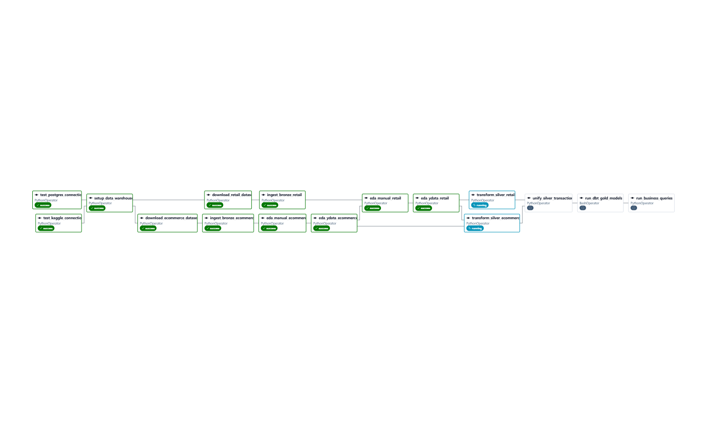
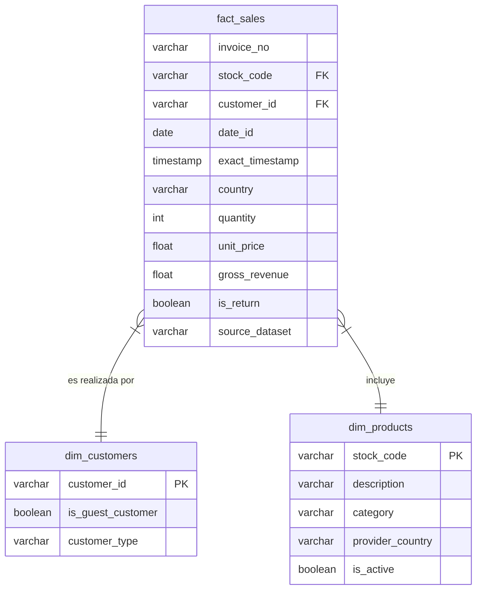

# DataMart S.A.S. - Pipeline ETL con Apache Airflow y Data Warehouse

Bienvenido al repositorio del proyecto **DataMart S.A.S.**. Este proyecto implementa una solución funcional de extremo a extremo, extrayendo datos transaccionales, transformándolos y cargándolos en un Data Warehouse (PostgreSQL) usando Apache Airflow en una arquitectura distribuida con Celery y Docker.

## Estructura del Proyecto
```text
├── data/                  # Volúmenes persistentes (Logs, Configs, certificados proxy)
├── docs/                  # Documentación de arquitectura, decisiones técnicas y EDA
├── envs/                  # Variables de entorno modulares para cada servicio
├── pipelines/             # Código fuente de Airflow (DAGs) y dbt (modelos SQL)
├── sources/               # Datos crudos (archivos CSV descargados)
├── docker-compose.yml     # Orquestación del clúster distribuido
└── README.md              # Documentación principal
```
## Arquitectura del Proyecto

El proyecto está diseñado siguiendo las mejores prácticas de **Infrastructure as Code (IaC)** e implementa una **Arquitectura Medallón (Bronze, Silver, Gold)**. 



Para un análisis profundo de la arquitectura técnica subyacente (Celery, Workers, Proxy Nginx, configuración del clúster), por favor revisa [docs/README.md](docs/README.md).

---

## Guía Rápida: Levantando el Entorno

El entorno está 100% dockerizado y configurado para funcionar automáticamente sin necesidad de realizar configuraciones manuales en la UI de Airflow para conexiones o variables (son autoinyectadas).

### 1. Prerrequisitos
- **Git**
- **Docker y Docker Compose** instalados (Docker Desktop recomendado en Windows/macOS).
- **Variables de Entorno:** Debes abrir el archivo `envs/.env.example` y crear todos los archivos individuales que ahí se detallan (`.env.global`, `.env.db`, `.env.broker`, `.env.proxy`, `.env.master`, `.env.worker`) dentro de la carpeta `envs/` reemplazando los placeholders por tus contraseñas y configuraciones.

### 2. Clonar e Iniciar
```bash
git clone <URL_DEL_REPOSITORIO>
cd <NOMBRE_CARPETA_DEL_PROYECTO>

# Levantar todos los servicios en segundo plano
docker compose up -d
```
*(Nota: La primera ejecución descargará las imágenes necesarias (Airflow, Postgres, RabbitMQ), lo que puede tomar varios minutos).*

### 3. Configurar Dominios Locales (Nginx Proxy Manager)
El clúster usa un proxy inverso para direccionar el tráfico limpiamente. Accede al administrador del proxy:
- **Administrador NPM:** `http://localhost:81` (Por defecto: `admin@example.com` / `changeme`)

Dentro del panel, configura los *Proxy Hosts* hacia los demás servicios siguiendo la lógica `[nombre].localhost`. Ejemplos:
- **Airflow UI:** Dominio `airflow.localhost` -> Apunta al contenedor `airflow-apiserver` en el puerto `8080`.
- **Flower Monitor:** Dominio `flower.localhost` -> Apunta al contenedor `celery-flower` en el puerto `5555`.

### 4. Ejecutar el Pipeline ETL
1. Una vez configurado el proxy, abre la UI de Airflow ingresando a `http://airflow.localhost`. Los credenciales configurados por el contenedor init son `admin` / `admin123` (según configuraste en tu `.env.master`).
2. **Validar Conexiones y Variables:** 
   El pipeline se encarga de crear la base de datos `db_geisler_prueba` y de configurar las conexiones y variables a través de scripts y variables de entorno al iniciar.
   - En la UI de Airflow, ve a **Admin -> Variables** y **Admin -> Connections** para confirmar que existen y están correctamente apuntadas.
3. **Activar el DAG:**
   Busca el DAG principal de extracción y carga (ej. `etl_datamart_dag`) y actívalo (switch a "On") o lánzalo manualmente dándole a **Play** (Trigger DAG). El DAG se encargará de:
   - Leer los archivos de la carpeta `sources/` (descargados de Kaggle).
   - Realizar la limpieza (Silver).
   - Inyectarlos a PostgreSQL.
4. **Verificar Resultados en el Repositorio Analítico:**
   Conéctate a la base de datos PostgreSQL expuesta en el puerto `5454` (revisa `.env.db` para credenciales). Usa tu cliente SQL preferido (DBeaver, pgAdmin) para explorar los esquemas `bronze`, `silver` y `gold`.

---

## Decisiones Técnicas y de Negocio (Highlights)

Para cumplir con los estrictos requerimientos analíticos de DataMart, se resolvieron las siguientes ambigüedades en la fuente de datos (lee la documentación detallada en [Decisiones Técnicas](docs/decisions/TECHNICAL_DECISIONS.md)):

1. **Manejo de Casos Ambiguos (Valores Nulos y Nombres):** 
   - **`customer_id` nulo:** En lugar de eliminar las transacciones (lo que descuadraría el balance financiero), se catalogaron dinámicamente como transacciones de *"Guest"* para aislar su comportamiento de compra frente a usuarios registrados.
   - **Descripciones inconsistentes:** Se implementó una regla que extrae siempre la última descripción válida agrupada por `stock_code` para garantizar catálogos unificados.
2. **Garantía de Idempotencia:**
   - Todo el flujo del DAG está diseñado para ser 100% idempotente. Ejecutar el pipeline múltiples veces para la misma fecha sobreescribirá correctamente las tablas (Drop & Replace en Silver, Materializaciones en dbt) sin duplicar registros transaccionales ni corromper las métricas.
3. **Estrategia de Modelado de Datos (Medallion Architecture):**
   - El Data Warehouse sigue una estructura progresiva: Bronze (Crudos sin procesar), Silver (Limpios/Tipados con reglas lógicas) y Gold (Modelado Dimensional listo para Business Intelligence). Lee la justificación completa en la [Estrategia de Modelado](docs/decisions/data_modeling_strategy.md).

## Modelo de Datos (Capa Gold)

El modelo de datos analítico en la capa Gold sigue un modelo en estrella, estructurando hechos (ventas) y dimensiones (productos, clientes) para responder eficientemente a las preguntas analíticas de negocio.



## Consultas de Validación (Business Questions)

El repositorio incluye las consultas SQL diseñadas para ejecutarse contra la Capa Gold y responder las preguntas clave planteadas por DataMart (Top productos, ticket promedio, revenue mensual, comportamiento de invitados, etc).

- Puedes encontrar el código SQL y la **Recomendación Estratégica al Equipo de Producto** en el documento de [Consultas de Negocio](docs/decisions/BUSINESS_QUERIES.md).

---
*Construido para la Prueba de Desempeño DataMart S.A.S.*
