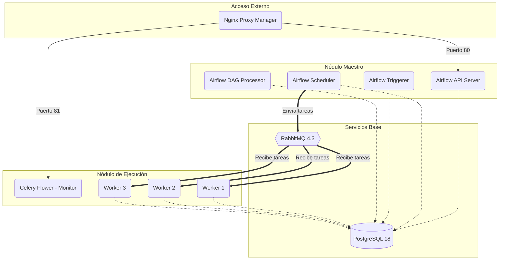
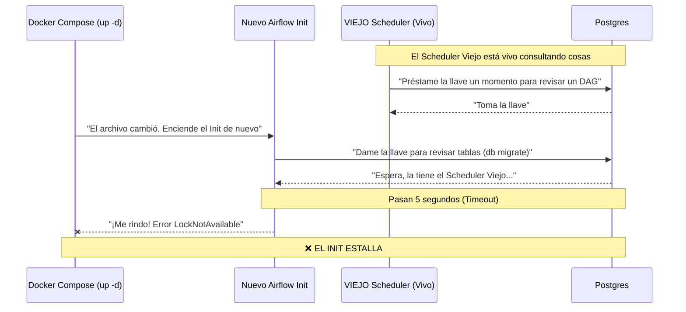
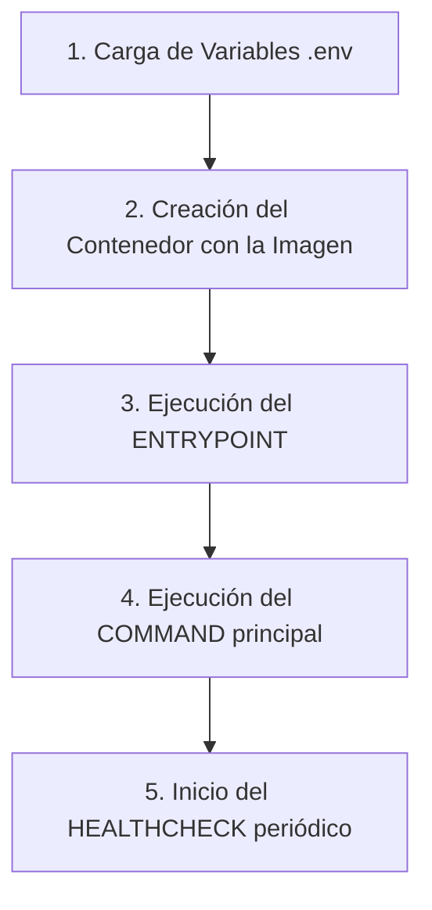

# 🚀 Clúster Distribuido de Apache Airflow 3.x con Celery

Este repositorio contiene la infraestructura como código (Docker Compose) para levantar un clúster distribuido, escalable y robusto de Apache Airflow 3.x. Está diseñado para separar responsabilidades emulando una arquitectura de nivel de producción.

## 🏛️ Arquitectura del Sistema

El clúster está compuesto por múltiples servicios que se comunican a través de una red interna de Docker.


## 📂 Decisiones de Infraestructura y Estructura de Directorios

Para mantener un entorno de grado de producción, la arquitectura separa estrictamente el código, los datos y las configuraciones para que sobrevivan a reinicios y actualizaciones. Todo esto se mapea a través de volúmenes de Docker:

- `/pipelines/dags/`: Contiene los archivos Python (los DAGs). Esta carpeta se monta en **modo solo lectura** (`ro`) en todos los contenedores de Airflow. Esto asegura que la lógica de negocio esté centralizada y protegida contra modificaciones accidentales por parte del sistema.
- `/pipelines/plugins/`: Plugins personalizados y librerías externas.
- `/data/`: El corazón de la persistencia local. Todo lo que está aquí sobrevive a los reinicios.
  - `/data/logs/`: Almacena los logs en texto plano de cada tarea ejecutada por los workers.
  - `/data/config/`: Archivos de configuración general (ej. el clásico `airflow.cfg`).
  - `/data/broker/`: Configuraciones "inyectadas" directamente a RabbitMQ (como el workaround para las colas transitorias).
  - `/data/proxy/`: Base de datos, configuraciones y certificados SSL (Let's Encrypt) para el Nginx Proxy Manager.
- `/envs/`: Carpeta modularizada que contiene los archivos `.env` (secretos y variables de entorno), dividiendo limpiamente las responsabilidades (`.env.global` vs `.env.worker`).

## 📦 Componentes del Clúster

| Servicio | Imagen | Propósito |
| :--- | :--- | :--- |
| **core-postgres** | `postgres:18-alpine` | La Metadata DB. El "cerebro" donde se guardan las configuraciones, usuarios, roles, y el estado de cada tarea. |
| **broker-rabbitmq** | `rabbitmq:4.3-management-alpine` | El "mesero". Recibe las tareas del Scheduler y las encola para que los Workers las consuman. |
| **airflow-init** | `apache/airflow:3.2.0` | Contenedor efímero. Corre una vez al inicio para crear las tablas en Postgres (`db migrate`) y crear el usuario administrador. |
| **airflow-apiserver** | `apache/airflow:3.2.0` | El backend FastAPI. Sirve la interfaz gráfica (UI) y las peticiones de la API. (Reemplaza al antiguo `webserver`). |
| **airflow-scheduler** | `apache/airflow:3.2.0` | El "Gerente". Revisa constantemente qué DAGs deben ejecutarse y manda las tareas a RabbitMQ. |
| **airflow-dag-processor**| `apache/airflow:3.2.0` | Lee físicamente los archivos `.py` de la carpeta `dags/` y los traduce a código entendible por Airflow. |
| **airflow-trigger** | `apache/airflow:3.2.0` | Gestiona tareas asíncronas (Deferrable Operators) para no gastar recursos esperando (ej. un sensor). |
| **airflow-worker** | `apache/airflow:3.2.0` | Los "Cocineros". 3 réplicas que escuchan a RabbitMQ, toman la tarea y ejecutan el código pesado de Python. |
| **airflow-flower** | `apache/airflow:3.2.0` | Interfaz gráfica dedicada exclusivamente a monitorear la salud y el estado de los workers de Celery. |
| **proxy-npm** | `jc21/nginx-proxy-manager` | Proxy inverso para acceder al clúster limpiamente a través de nombres de dominio locales sin usar puertos. |

## ⚙️ Estructura de Variables de Entorno (`/envs`)

El proyecto utiliza un patrón modular para la inyección de secretos y configuraciones:

- `.env.db`: Credenciales exclusivas para que la base de datos se inicialice.
- `.env.broker`: Credenciales de RabbitMQ (usuario, cookie de Erlang).
- `.env.global`: El hilo conductor. Aquí se arma la conexión de Base de Datos y de RabbitMQ (`AIRFLOW__DATABASE__SQL_ALCHEMY_CONN`, `AIRFLOW__CELERY__BROKER_URL`) para que **todos** los contenedores hablen el mismo idioma.
- `.env.master`: Configuraciones core (Auth Manager, Webserver, Dag Processor). Ojo: En Airflow 3, el rol de administrador es estrictamente `Admin` (con A mayúscula).
- `.env.worker`: Variables específicas para inyectar a los workers de Celery (concurrencia, autoescalado).

## 🌍 Guía de Instalación Universal (Windows, macOS, Linux)

Al estar basado 100% en contenedores, este clúster correrá de forma idéntica en cualquier sistema operativo. Sigue estos pasos para arrancar el proyecto desde cero:

### 1. Prerrequisitos Obligatorios
- **Git:** Instalado en tu máquina.
- **Docker Engine y Docker Compose:**
  - *Usuarios Windows / macOS:* Descarga e instala [Docker Desktop](https://www.docker.com/products/docker-desktop/).
  - *Usuarios Linux:* Instala Docker Engine y el plugin de Compose nativo (`sudo apt install docker-ce docker-compose-plugin`).

### 2. Clonar el repositorio
Abre tu terminal preferida (PowerShell, Bash, Zsh) y clona el proyecto:
```bash
git clone <URL_DEL_REPOSITORIO>
cd <NOMBRE_CARPETA_DEL_PROYECTO>
```

### 3. Encender el Clúster
Asegúrate de estar en el mismo directorio donde vive el archivo `docker-compose.yml` y ejecuta:
```bash
docker compose up -d
```
*(Nota: La primera vez tomará varios minutos, ya que Docker descargará gigabytes de imágenes de Internet como Postgres, RabbitMQ y Airflow).*

### 4. Acceder a las Interfaces
Una vez que el comando finalice y todos los servicios estén en estado *Up* y *Healthy*, abre tu navegador:
- **Airflow UI:** `http://localhost:80` (A través de Nginx Proxy Manager)
- **Celery Flower (Monitor de Workers):** `http://localhost:81`

---

## 🚀 Mantenimiento y Ejecución

### Arranque en Limpio (Recomendado)
Para evitar el problema de colisión de candados en la base de datos (LockNotAvailable), siempre se recomienda usar la siguiente secuencia al realizar cambios estructurales:

```bash
docker compose down
docker compose up -d
```

### Monitoreo
Para revisar por qué un servicio específico falló (Ej. un worker):
```bash
docker compose logs -f airflow-worker
```

## 🛠️ Lecciones Aprendidas y Resoluciones de Conflictos

### 1. RabbitMQ 4.3 vs Celery (Colas Transitorias)
- **El Problema:** RabbitMQ 4.x deshabilitó por defecto la función `transient_nonexcl_queues` argumentando obsolescencia. Sin embargo, Celery (el corazón de nuestros Workers) requiere esta característica para su sistema de comunicación interno (el `pidbox`). Al arrancar, los Workers se estrellaban.
- **La Solución:** Se inyectó un archivo de configuración explícito (`data/broker/rabbitmq.conf`) habilitando la directiva `deprecated_features.permit.transient_nonexcl_queues = true` para forzar a RabbitMQ a permitir esta comunicación sin tener que retroceder a RabbitMQ 3.x. Adicionalmente, el `mem_limit` se ajustó para evitar cuellos de botella (OOM Killed).

### 2. El problema del "Advisory Lock" de Postgres (La Carrera por la Base de Datos)
- **El Problema:** Al ejecutar `docker compose up -d` para actualizar el clúster sin haber hecho un `down` previo, el contenedor `airflow-init` fallaba con `psycopg2.errors.LockNotAvailable`.
- **Por qué pasa esto (El flujo de Docker):** `docker compose up -d` no apaga todo por defecto; es un sincronizador. Si cambias la memoria de un servicio (ej. RabbitMQ), Docker reinicia ese servicio y lanza el `airflow-init` de nuevo porque el archivo se actualizó. Sin embargo, como el Scheduler y el API-Server no tenían cambios en el archivo, Docker los deja vivos en segundo plano. 
- **La colisión:** Postgres usa una llave única (Advisory Lock) para hacer migraciones. Como los contenedores viejos seguían vivos y conectados a la base de datos, retenían la llave. El nuevo `init` intentaba pedirla y moría por *Timeout*.



- **La Solución:** Siempre "limpiar la mesa" apagando todo primero (`docker compose down`) antes de un `up -d` cuando hay cambios estructurales.

---

## 🔄 Ciclo de Vida de la Ejecución en Docker Compose

Para entender cómo nace cada servicio dentro de nuestro clúster (por ejemplo, los workers o el scheduler), este es el flujo interno paso a paso:



**Explicación del Flujo:**
1. **Carga de Variables:** Docker lee los archivos `.env` (ej. `.env.global`, `.env.worker`) e inyecta estas variables en la memoria temporal antes de que exista el sistema operativo del contenedor.
2. **Creación del Contenedor:** Se levanta el cascarón basado en la imagen descargada (ej. `apache/airflow:3.2.0`).
3. **ENTRYPOINT:** Es el "portero" (gatekeeper) o script maestro que viene integrado dentro de la imagen de Airflow. Él toma las variables de entorno, verifica que los permisos sean correctos, y configura la base para que Airflow corra de forma segura.
4. **COMMAND:** Es la instrucción final que le pasamos en el `docker-compose.yml`. Una vez el entrypoint da luz verde, ejecuta nuestro comando. Por ejemplo, en los workers, este comando es `bash -c "airflow celery worker --autoscale=4,1"`.
5. **HEALTHCHECK:** Una vez el programa está corriendo, Docker empieza a hacerle "preguntas" periódicas (cada 30s) para ver si sigue vivo. Si responde bien, lo marca como `Healthy`. Si no, lo marca como `Unhealthy` o lo reinicia según la política configurada.

---
*Construido colaborativamente con IA.*
