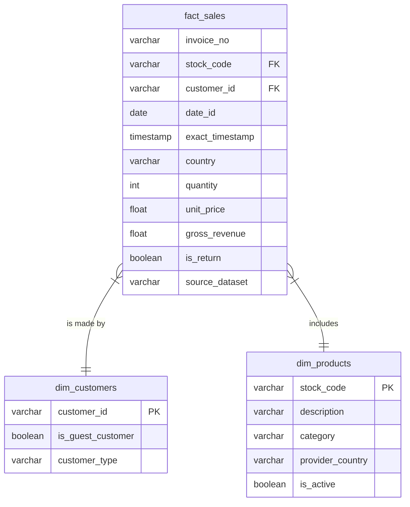

# DataMart S.A.S. - ETL Pipeline with Apache Airflow and Data Warehouse

Welcome to the **DataMart S.A.S.** project repository. This project implements a functional end-to-end solution, extracting transactional data, transforming it, and loading it into an Analytical Data Warehouse (PostgreSQL) using Apache Airflow in a distributed architecture with Celery and Docker.

## Project Structure
```text
├── data/                  # Persistent volumes (Logs, Configs, proxy certificates)
├── docs/                  # Architecture documentation, technical decisions, and EDA
├── envs/                  # Modular environment variables for each service
├── pipelines/             # Airflow source code (DAGs) and dbt (SQL models)
├── sources/               # Raw data (downloaded CSV files)
├── docker-compose.yml     # Distributed cluster orchestration
└── README.md              # Main documentation (Spanish)
└── README_en.md           # Main documentation (English)
```
## Project Architecture

The project is designed following **Infrastructure as Code (IaC)** best practices and implements a **Medallion Architecture (Bronze, Silver, Gold)**. 


For an in-depth analysis of the underlying technical architecture (Celery, Workers, Nginx Proxy, cluster configuration), please review [docs/README.md](docs/README.md).

---

## Quick Start: Bringing Up the Environment

The environment is 100% dockerized and configured to work automatically without needing any manual configurations in the Airflow UI for connections or variables (they are auto-injected).

### 1. Prerequisites
- **Git**
- **Docker and Docker Compose** installed (Docker Desktop recommended on Windows/macOS).
- **Environment Variables:** You must open the `envs/.env.example` file and create all the individual files detailed there (`.env.global`, `.env.db`, `.env.broker`, `.env.proxy`, `.env.master`, `.env.worker`) inside the `envs/` folder, replacing the placeholders with your passwords and configurations.

### 2. Clone and Start
```bash
git clone <REPOSITORY_URL>
cd <PROJECT_FOLDER_NAME>

# Bring up all services in the background
docker compose up -d
```
*(Note: The first execution will download the necessary images (Airflow, Postgres, RabbitMQ), which may take several minutes).*

### 3. Configure Local Domains (Nginx Proxy Manager)
The cluster uses a reverse proxy to route traffic cleanly. Access the proxy manager:
- **NPM Manager:** `http://localhost:81` (Default: `admin@example.com` / `changeme`)

Inside the panel, configure the *Proxy Hosts* to the other services following the `[name].localhost` logic. Examples:
- **Airflow UI:** Domain `airflow.localhost` -> Points to the `airflow-apiserver` container on port `8080`.
- **Flower Monitor:** Domain `flower.localhost` -> Points to the `celery-flower` container on port `5555`.

### 4. Run the ETL Pipeline
1. Once the proxy is configured, open the Airflow UI by going to `http://airflow.localhost`. The credentials configured by the init container are `admin` / `admin123` (as configured in your `.env.master`).
2. **Validate Connections and Variables:** 
   The pipeline takes care of creating the `db_geisler_prueba` database and configuring connections and variables via scripts and environment variables upon startup.
   - In the Airflow UI, go to **Admin -> Variables** and **Admin -> Connections** to confirm they exist and are correctly pointed.
3. **Trigger the DAG:**
   Find the main extraction and loading DAG (e.g. `etl_datamart_pipeline`) and activate it (switch to "On") or trigger it manually by clicking **Play** (Trigger DAG). The DAG will handle:
   - Reading files from the `sources/` folder (downloaded from Kaggle).
   - Performing cleaning transformations (Silver layer).
   - Loading them into PostgreSQL.
4. **Verify Results in the Analytical Repository:**
   Connect to the exposed PostgreSQL database on port `5454` (check `.env.db` for credentials). Use your preferred SQL client (DBeaver, pgAdmin) to explore the `bronze`, `silver`, and `gold` schemas.

---

## Technical and Business Decisions (Highlights)

To comply with DataMart's strict analytical requirements, the following ambiguities in the data source were resolved (read the detailed documentation in [Technical Decisions](docs/decisions/TECHNICAL_DECISIONS.md)):

1. **Handling Ambiguous Cases (Null Values and Names):** 
   - **Null `customer_id`:** Instead of dropping transactions (which would unbalance financial reports), they were dynamically categorized as *"Guest"* transactions to isolate their purchasing behavior from registered users.
   - **Inconsistent Descriptions:** A rule was implemented that always extracts the last valid description grouped by `stock_code` to guarantee unified catalogs.
2. **Idempotency Guarantee:**
   - The entire DAG flow is designed to be 100% idempotent. Running the pipeline multiple times for the same date will correctly overwrite tables (Drop & Replace in Silver, Incremental Materializations in dbt) without duplicating transactional records or corrupting metrics.
3. **Data Modeling Strategy (Medallion Architecture):**
   - The Data Warehouse follows a progressive structure: Bronze (Raw data), Silver (Cleaned/Typed with logical rules), and Gold (Dimensional Modeling ready for Business Intelligence). Read the full justification in the [Modeling Strategy](docs/decisions/data_modeling_strategy.md).

## Data Model (Gold Layer)

The analytical data model in the Gold layer follows a star schema, structuring facts (sales) and dimensions (products, customers) to efficiently answer analytical business questions.



## Validation Queries (Business Questions)

The repository includes the SQL queries designed to run against the Gold Layer and answer the key questions posed by DataMart (Top products, average ticket, monthly revenue, guest behavior, etc.).

- You can find the SQL code and the **Strategic Recommendation to the Product Team** in the [Business Queries](docs/decisions/BUSINESS_QUERIES.md) document.

---
*Built for the DataMart S.A.S. Performance Test*
