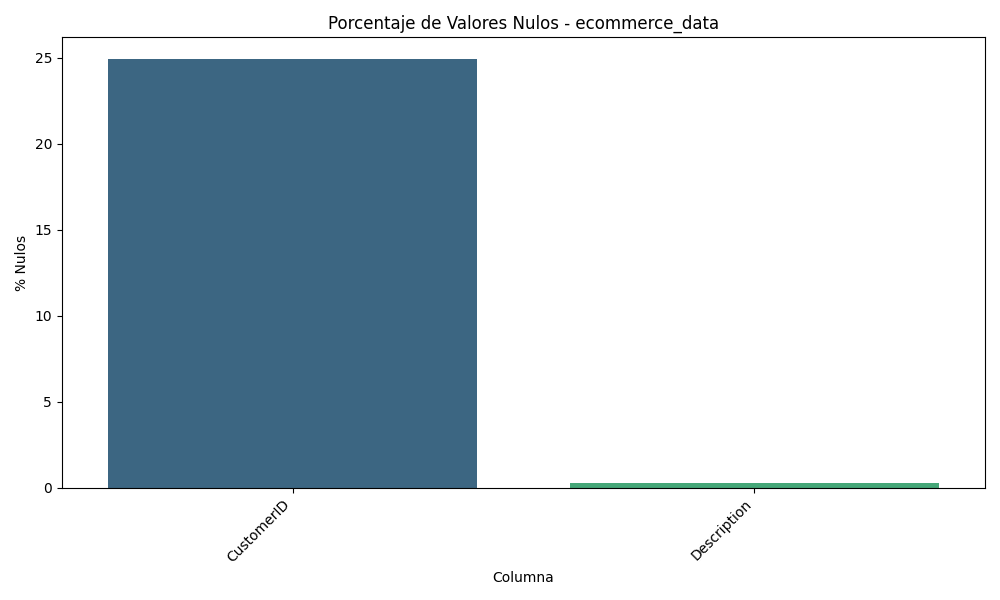
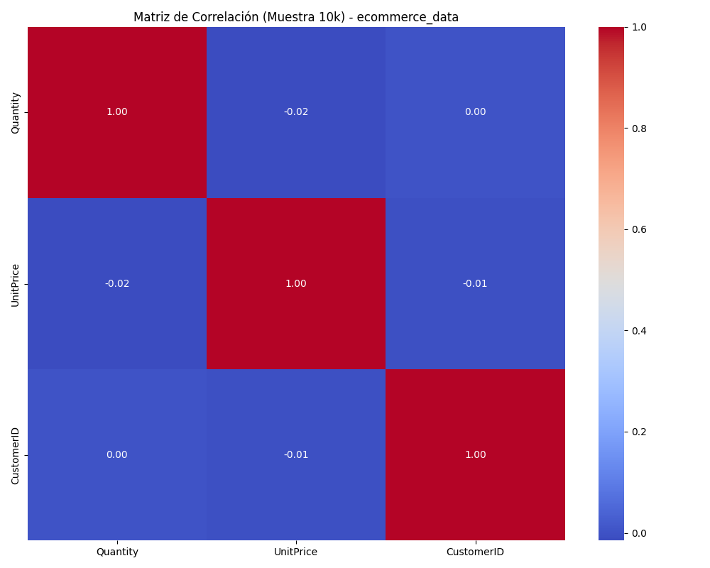
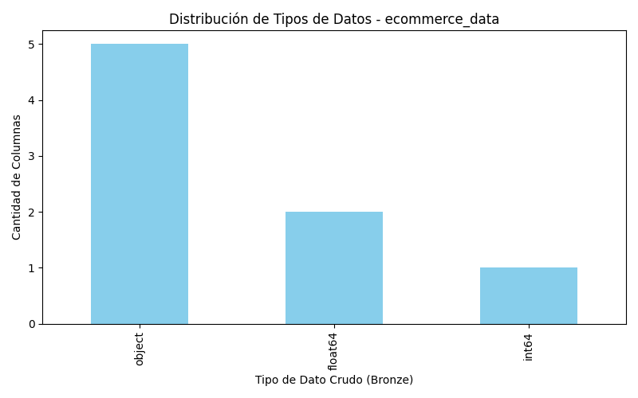

# Data Quality Report - Capa Bronze: `ecommerce_data`

## Dimensiones del Dataset
- **Filas Totales:** 541,909
- **Columnas Totales:** 8

## Análisis de Valores Nulos
| Columna | % Nulos |
|---------|---------|
| CustomerID | 24.93 |
| Description | 0.27 |

## Resumen Estadístico (Variables Numéricas)
| Statistic | Quantity | UnitPrice | CustomerID |
|-----------|----------|-----------|------------|
| count | 541909.00 | 541909.00 | 406829.00 |
| mean | 9.55 | 4.61 | 15287.69 |
| std | 218.08 | 96.76 | 1713.60 |
| min | -80995.00 | -11062.06 | 12346.00 |
| 25% | 1.00 | 1.25 | 13953.00 |
| 50% | 3.00 | 2.08 | 15152.00 |
| 75% | 10.00 | 4.13 | 16791.00 |
| max | 80995.00 | 38970.00 | 18287.00 |

## Diccionario Físico (Tipos de Datos)

