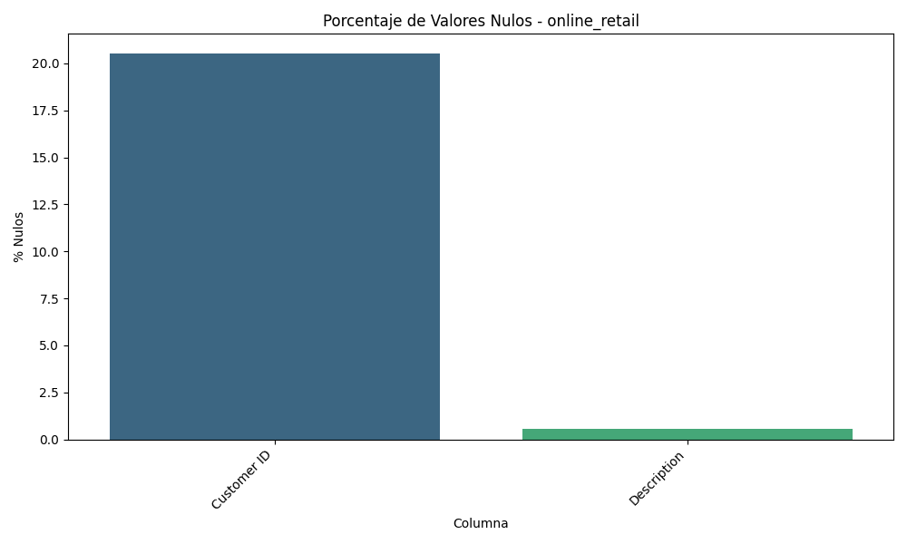
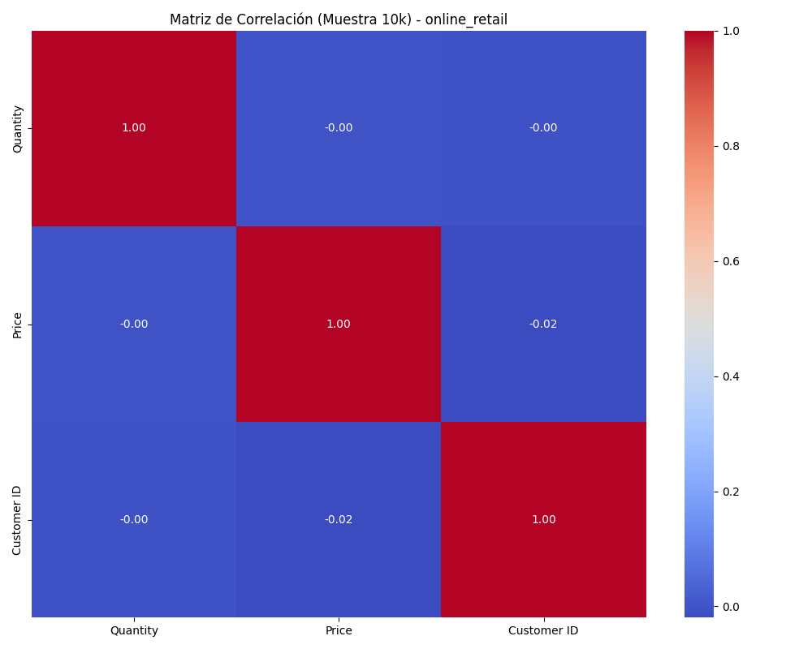
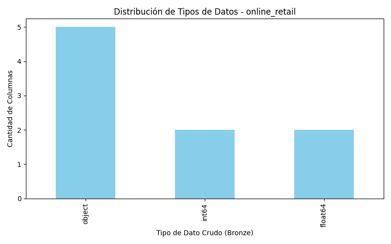

# Data Quality Report - Capa Bronze: `online_retail`

## Dimensiones del Dataset
- **Filas Totales:** 525,461
- **Columnas Totales:** 8

## Análisis de Valores Nulos
| Columna | % Nulos |
|---------|---------|
| Customer ID | 20.54 |
| Description | 0.56 |

## Resumen Estadístico (Variables Numéricas)
| Statistic | Quantity | InvoiceDate | Price | Customer ID |
|-----------|----------|-------------|-------|-------------|
| count | 525461.00 | 525461 | 525461.00 | 417534.00 |
| mean | 10.34 | 2010-06-28 11:37:36.845017856 | 4.69 | 15360.65 |
| min | -9600.00 | 2009-12-01 07:45:00 | -53594.36 | 12346.00 |
| 25% | 1.00 | 2010-03-21 12:20:00 | 1.25 | 13983.00 |
| 50% | 3.00 | 2010-07-06 09:51:00 | 2.10 | 15311.00 |
| 75% | 10.00 | 2010-10-15 12:45:00 | 4.21 | 16799.00 |
| max | 19152.00 | 2010-12-09 20:01:00 | 25111.09 | 18287.00 |
| std | 107.42 | nan | 146.13 | 1680.81 |

## Diccionario Físico (Tipos de Datos)

